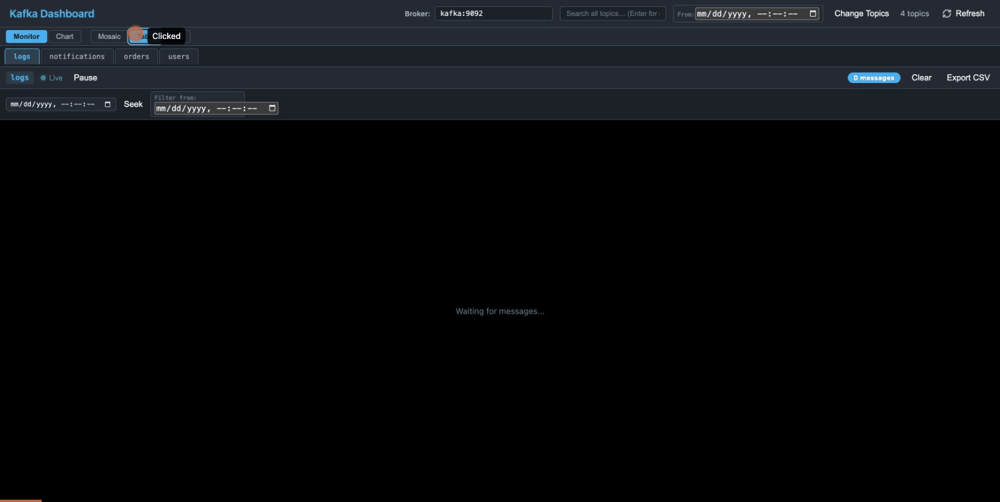

# Kafka Dashboard

Real-time Kafka topic monitoring dashboard with a Rust backend and React frontend. Each topic gets its own draggable, resizable window panel showing live-streamed messages as they arrive.

## Demo



## Features

- **Topic selector** — choose which topics to monitor before opening panels
- **3 layout modes** — **Mosaic** (tiling drag & resize), **Tabs** (single-topic focus with scrollable tab bar), **Grid** (auto-fill responsive grid). Auto-selects Tabs when > 6 topics
- **Timeseries chart** — Monitor/Chart toggle shows a live line chart of message rate per topic (5-second buckets, 5-minute rolling window via recharts)
- **Live message streaming** — WebSocket per topic with automatic reconnect
- **Pause / Play** — freeze live message ingestion per topic, resume anytime
- **Seek by timestamp** — jump to historical messages from any date/time
- **Message truncation** — messages longer than 200 characters are truncated with `...`; click Expand/Collapse to toggle full view
- **Key + Value display** — each message shows both key and value as labeled rows
- **Color-coded messages** — 20-color rotating palette on black background for readability
- **Export to CSV** — download visible messages per topic as a CSV file
- **Global search + results panel** — type a query and press Enter to open a dedicated search results panel that collates matches from all selected topics with highlighted results grouped by topic
- **Date filtering** — global date filter in the header applies to all topics; each window has a local date filter that overrides the global one. Both have × clear buttons
- **Runtime broker config** — switch Kafka broker address from the header bar without restarting
- **Virtualized scrolling** — smooth performance with thousands of messages via react-virtuoso
- **Prominent topic labels** — blue-accented title bars with clear topic names and blue pill message count badges

---

## High-Level Architecture

```
┌─────────────────────────────────────────────────────────────────────┐
│                        Docker Compose Stack                        │
│                                                                     │
│  ┌──────────────┐    ┌───────────────────────┐    ┌──────────────┐ │
│  │              │    │   Rust Backend         │    │   Seed       │ │
│  │  Kafka 3.7   │◄───┤   (actix-web)         │    │   Producer   │ │
│  │  KRaft Mode  │    │                       │    │              │ │
│  │              │───►│  TopicManager          │    │  4 topics    │ │
│  │  No Zookeeper│    │    ├─ StreamConsumer/t │    │  every 2s    │ │
│  │              │    │    ├─ broadcast::channel│    │              │ │
│  │  Port: 9092  │    │    └─ AdminConsumer     │    └──────┬───────┘ │
│  │  (internal)  │    │                       │             │        │
│  │  Port: 9094  │    │  REST API + WebSocket │             │        │
│  │  (external)  │    │  Port: 3001           │             │        │
│  └──────────────┘    └───────────┬───────────┘             │        │
│                                  │                         │        │
│                                  │ Produces JSON to Kafka  │        │
│                                  │ ◄───────────────────────┘        │
└──────────────────────────────────┼──────────────────────────────────┘
                                   │
                                   │ HTTP / WebSocket
                                   ▼
                    ┌──────────────────────────────┐
                    │      React Frontend          │
                    │      (served as static)      │
                    │                              │
                    │  ┌────────┐  ┌────────┐      │
                    │  │ Topic  │  │ Topic  │ ...  │
                    │  │ Window │  │ Window │      │
                    │  │ (WS)   │  │ (WS)   │      │
                    │  └────────┘  └────────┘      │
                    │                              │
                    │  Browser: localhost:3001     │
                    └──────────────────────────────┘
```

---

## Design Choices

### Why Rust + actix-web?

The backend needs to hold long-lived WebSocket connections and Kafka consumers concurrently. Actix-web on Tokio gives us lightweight async tasks, zero-cost abstractions, and low memory overhead. A single binary serves both the REST API and the bundled React SPA — no separate web server or reverse proxy needed.

### TopicManager: One Consumer Per Topic, N Clients

The central design pattern is the `TopicManager`:

```
                   TopicManager
                   ┌─────────────────────────────────────┐
                   │  brokers: Arc<Mutex<String>>         │
                   │  channels: Arc<Mutex<HashMap<        │
                   │    String,                           │
                   │    broadcast::Sender<KafkaMessage>   │
                   │  >>>                                 │
                   └──────────┬──────────────────────────┘
                              │
            ┌─────────────────┼─────────────────┐
            │                 │                 │
     ┌──────▼──────┐  ┌──────▼──────┐  ┌──────▼──────┐
     │  "orders"   │  │  "users"    │  │  "logs"     │
     │             │  │             │  │             │
     │ StreamCons. │  │ StreamCons. │  │ StreamCons. │
     │     │       │  │     │       │  │     │       │
     │     ▼       │  │     ▼       │  │     ▼       │
     │ broadcast   │  │ broadcast   │  │ broadcast   │
     │  ::Sender   │  │  ::Sender   │  │  ::Sender   │
     │   / | \     │  │   / | \     │  │     |       │
     │  R1 R2 R3   │  │  R1 R2 R3   │  │    R1       │
     └─────────────┘  └─────────────┘  └─────────────┘
       3 WS clients     3 WS clients    1 WS client
```

- **Lazy consumer spawn**: The first WebSocket subscription for a topic creates a `StreamConsumer` + `broadcast::channel(1024)`. Subsequent subscribers just call `tx.subscribe()` to get a new `Receiver`.
- **No duplicate reads**: Only one Kafka consumer per topic exists regardless of how many browser tabs are open.
- **Backpressure via broadcast**: If a client falls behind, `broadcast` reports `Lagged(n)` — the session logs a warning and catches up from the latest message.
- **Cleanup on broker change**: `set_brokers()` clears the entire channel map. Old consumers exit naturally when all senders/receivers are dropped.

### Why broadcast instead of mpsc?

`tokio::sync::broadcast` supports multiple receivers from a single sender without cloning messages for each. This is ideal for fan-out: one Kafka consumer produces messages, and N WebSocket sessions each get their own independent cursor into the ring buffer.

### WebSocket Session Loop

Each connected client runs a `tokio::select!` loop with three branches:

```
┌─────────────────────────────────────────────────┐
│              ws_session task                     │
│                                                  │
│  loop {                                          │
│    tokio::select! {                              │
│      ┌───────────────────────────────────────┐  │
│      │ Branch 1: broadcast::Receiver::recv() │  │
│      │ → Serialize KafkaMessage to JSON      │  │
│      │ → session.text(json)                  │  │
│      └───────────────────────────────────────┘  │
│      ┌───────────────────────────────────────┐  │
│      │ Branch 2: msg_stream.next()           │  │
│      │ → Handle Ping/Pong/Close from client  │  │
│      └───────────────────────────────────────┘  │
│      ┌───────────────────────────────────────┐  │
│      │ Branch 3: heartbeat_interval.tick()   │  │
│      │ → session.ping() every 10s            │  │
│      │ → Detects dead connections            │  │
│      └───────────────────────────────────────┘  │
│    }                                             │
│  }                                               │
└─────────────────────────────────────────────────┘
```

### Seek: Historical Message Replay

The seek endpoint (`POST /api/seek/{topic}`) creates a **temporary, short-lived** `BaseConsumer` (not the shared `StreamConsumer`) to fetch historical data:

```
  Client                     Backend                         Kafka
    │                          │                               │
    │ POST /api/seek/orders    │                               │
    │ { timestamp_ms: ... }    │                               │
    │─────────────────────────►│                               │
    │                          │  1. fetch_metadata(topic)     │
    │                          │──────────────────────────────►│
    │                          │◄──────────────────────────────│
    │                          │  2. offsets_for_times(ts)     │
    │                          │──────────────────────────────►│
    │                          │  (returns offset per partition)│
    │                          │◄──────────────────────────────│
    │                          │  3. assign(offsets)           │
    │                          │  4. poll() up to 200 msgs    │
    │                          │  or 5s deadline              │
    │                          │──────────────────────────────►│
    │                          │◄──────────────────────────────│
    │  200 OK                  │                               │
    │  [KafkaMessage, ...]     │                               │
    │◄─────────────────────────│                               │
    │                          │  (consumer dropped)           │
```

The temporary consumer uses `enable.auto.commit = false` and a dedicated group (`kafka-dashboard-seek`) so it never interferes with the live streaming consumers.

### Runtime Broker Switching

Changing the broker at runtime triggers a coordinated swap:

```
  UI                    POST /api/broker           TopicManager
  │                     { brokers: "new:9092" }         │
  │────────────────────────────────►│                    │
  │                                 │  1. Create new     │
  │                                 │     AdminConsumer   │
  │                                 │  2. Lock & replace  │
  │                                 │     SharedAdmin     │
  │                                 │  3. set_brokers()   │
  │                                 │────────────────────►│
  │                                 │     Lock brokers    │
  │                                 │     *brokers = new  │
  │                                 │     Lock channels   │
  │                                 │     channels.clear()│
  │                                 │     (old consumers  │
  │                                 │      exit when Tx   │
  │                                 │      is dropped)    │
  │  200 OK { brokers }            │◄────────────────────│
  │◄────────────────────────────────│                    │
  │                                 │                    │
  │  Re-fetch /api/topics           │                    │
  │  (now uses new AdminConsumer)   │                    │
```

### Frontend: Pause Without Disconnecting

Pause is implemented purely on the client side. The WebSocket stays connected (to avoid re-triggering Kafka consumer group rebalances), but `onmessage` silently discards incoming data while `pausedRef.current === true`. This is a `useRef` (not state) so the check has zero render cost.

### Docker Multi-Stage Build

```
┌──────────────────┐     ┌──────────────────────┐     ┌─────────────────┐
│ Stage 1           │     │ Stage 2               │     │ Stage 3          │
│ node:18-alpine   │     │ rust:1.88-bookworm    │     │ debian:bookworm  │
│                  │     │                      │     │  -slim           │
│ npm ci           │     │ cmake + libssl-dev   │     │                 │
│ tsc && vite build│     │                      │     │ ca-certs +      │
│                  │     │ Dep cache trick:     │     │ libssl3         │
│ Output:          │     │  dummy main.rs first │     │                 │
│  frontend/dist/  │     │  cargo build --rel   │     │ COPY binary     │
│                  │     │  then real src/      │     │ COPY static/    │
│                  │     │                      │     │                 │
│                  │     │ static-kafka feature  │     │ ~85 MB total    │
│                  │     │ (cmake-build)        │     │                 │
└──────────────────┘     └──────────────────────┘     └─────────────────┘
```

**Why static linking for librdkafka?** Debian Bookworm ships librdkafka 1.9.x, but rdkafka-sys 4.10.0 requires >= 2.12.1. Rather than building librdkafka from source separately, the `cmake-build` Cargo feature compiles it inline during `cargo build`. This adds ~3 minutes to the build but produces a fully self-contained binary.

**Dependency cache trick**: The Dockerfile copies `Cargo.toml` + `Cargo.lock` first, creates a dummy `main.rs`, and runs `cargo build --release`. This caches all dependency compilation. Only the final `COPY src/ + cargo build` recompiles the application code (~20s instead of ~5min).

---

## User Flow

```
┌──────────────────────────────────────────────────────────────────────┐
│  1. LAUNCH                                                           │
│     docker compose up -d                                            │
│     Browser → http://localhost:3001                                 │
│                                                                      │
│  2. BROKER CONFIG (optional)                                         │
│     ┌──────────────────────────────────────────────────┐             │
│     │  Header: [Broker: kafka:9092    ] [Connect]      │             │
│     │  Edit the input → click Connect → topics refresh  │             │
│     └──────────────────────────────────────────────────┘             │
│                                                                      │
│  3. SELECT TOPICS                                                    │
│     ┌──────────────────────────────────┐                             │
│     │  ☑ orders                        │                             │
│     │  ☑ users                         │                             │
│     │  ☐ notifications                 │                             │
│     │  ☑ logs                          │                             │
│     │                                  │                             │
│     │  [Select All] [Clear]            │                             │
│     │  [ Open 3 Topics ]              │                             │
│     └──────────────────────────────────┘                             │
│                                                                      │
│  4. LAYOUT & MONITORING                                              │
│     Header: [Search...] [From: datetime] [Change Topics]             │
│                                                                      │
│     View toggle:  [Monitor] [Chart]                                  │
│     Layout mode:  [Mosaic] [Tabs] [Grid]                             │
│                                                                      │
│     Mosaic (default for ≤6 topics):                                  │
│     ┌─────────────────────┬─────────────────────┐                    │
│     │ orders         42 ● │ users          18 ● │                    │
│     │ ● Live  [Pause]     │ ● Live  [Pause]     │                    │
│     │ [seek] [Filter from]│ [seek] [Filter from]│                    │
│     │                     │                     │                    │
│     │ Key: order-42       │ Key: user-7         │                    │
│     │ Val: {"id":42,...}  │ Val: {"action":...} │                    │
│     ├─────────────────────┴─────────────────────┤                    │
│     │ logs                              201 ●   │                    │
│     │ Val: {"level":"info","msg":"Requ...  [+]  │                    │
│     └───────────────────────────────────────────┘                    │
│                                                                      │
│  5. CHART VIEW                                                       │
│     Toggle to [Chart] → live line chart of msg/5s per topic          │
│     Updates every 2 seconds, rolling 5-minute window                 │
│                                                                      │
│  6. SEARCH (Enter → results panel)                                   │
│     Type query → Enter → modal with results grouped by topic         │
│     Each match shows partition, offset, timestamp + highlight        │
│                                                                      │
│  7. DATE FILTERING                                                   │
│     Global: header [From: ___] applies to all windows                │
│     Local:  per-window [Filter from: ___] overrides global           │
│                                                                      │
│  8. EXPORT                                                           │
│     Click [Export CSV] on any topic → downloads .csv with:           │
│     topic, partition, offset, key, value, timestamp                  │
└──────────────────────────────────────────────────────────────────────┘
```

---

## API Reference

| Method | Endpoint | Description |
|--------|----------|-------------|
| `GET` | `/api/topics` | List all non-internal Kafka topics (filters `__` prefixed). Uses `fetch_metadata` via `BaseConsumer`. |
| `GET` | `/api/broker` | Return the current broker bootstrap address. |
| `POST` | `/api/broker` | Update broker config at runtime. Body: `{ "brokers": "host:port" }`. Replaces admin consumer, clears all active topic consumers. |
| `POST` | `/api/seek/{topic}` | Fetch historical messages from a timestamp. Body: `{ "timestamp_ms": 1707840000000, "max_messages": 200 }`. Creates a temporary consumer, resolves offsets via `offsets_for_times`, polls up to 200 messages or 5s. |
| `WS` | `/ws/{topic}` | Upgrade to WebSocket. Streams `KafkaMessage` JSON frames in real-time. Auto-subscribes to TopicManager (lazy consumer creation). Heartbeat ping every 10s. |

### KafkaMessage JSON Schema

```json
{
  "topic": "orders",
  "partition": 0,
  "offset": 1234,
  "key": "order-42",
  "payload": "{\"id\":42,\"item\":\"widget\",\"qty\":3}",
  "timestamp": 1707840000000
}
```

---

## Tech Stack

| Layer | Technology | Why |
|-------|------------|-----|
| Backend | Rust, actix-web 4, actix-ws | Async, low-memory, serves REST + WS + static in one binary |
| Kafka client | rdkafka 0.37 (librdkafka) | Production-grade C client with Rust bindings |
| Async runtime | Tokio | Industry standard, required by actix + rdkafka |
| Frontend | React 18, TypeScript, Vite | Fast dev experience, type safety |
| Window layout | react-mosaic-component | Tiling WM for the browser (used by Palantir) |
| Message list | react-virtuoso | Virtualized rendering for large lists |
| Charts | recharts | Composable SVG line charts for message rate timeseries |
| Theme | Blueprint.js (dark) | Consistent dark UI components |
| Containerization | Docker multi-stage, Compose, Kubernetes | Single command deployment (Docker or Minikube) |

---

## Quick Start (Docker)

```bash
docker compose up -d
```

This starts three services:

| Service | Image | Description |
|---------|-------|-------------|
| **kafka** | `apache/kafka:3.7.0` | Kafka broker in KRaft mode (no Zookeeper). Internal: `9092`, External: `9094` |
| **dashboard** | Built from `Dockerfile` | Rust binary serving React SPA on port `3001` |
| **seed** | `apache/kafka:3.7.0` | Creates 4 topics (`orders`, `users`, `notifications`, `logs`) with 2 partitions each, produces JSON messages every 2 seconds |

Open **http://localhost:3001** in your browser.

```bash
# View logs
docker compose logs -f dashboard

# Stop everything
docker compose down
```

---

## Kubernetes (Minikube)

The project includes full Kubernetes manifests for deploying on Minikube. The setup mirrors Docker Compose with three components: Kafka StatefulSet (5Gi persistent storage), Dashboard Deployment, and Seed Producer Deployment.

### Prerequisites

- Minikube installed
- kubectl configured
- Minimum: 4 CPUs, 4GB RAM, 20GB disk

### Deploy

```bash
# Start Minikube
minikube start --cpus=4 --memory=4096 --disk-size=20g

# Run the automated deployment script
./k8s/deploy.sh
```

The script builds the dashboard image using Minikube's Docker daemon, deploys all manifests in order, waits for readiness, and displays the dashboard URL.

### Access the Dashboard

```bash
# Direct access via NodePort
http://$(minikube ip):30001

# Or auto-open in browser
minikube service dashboard -n kafka-dashboard

# Or port-forward to localhost
kubectl port-forward -n kafka-dashboard service/dashboard 3001:3001
```

### Verify

```bash
# Check pods
kubectl get pods -n kafka-dashboard

# List Kafka topics
kubectl exec -it kafka-0 -n kafka-dashboard -- \
  /opt/kafka/bin/kafka-topics.sh --bootstrap-server localhost:9092 --list
```

### Cleanup

```bash
./k8s/cleanup.sh
```

### Architecture

```
Minikube Cluster (namespace: kafka-dashboard)
┌─────────────────────────────────────────────────────────────────┐
│                                                                 │
│  ┌────────────────────┐  ┌──────────────────┐  ┌─────────────┐ │
│  │ StatefulSet: kafka │  │ Deploy: dashboard │  │ Deploy: seed│ │
│  │                    │  │                   │  │             │ │
│  │ apache/kafka:3.7.0 │  │ kafka-dashboard   │  │ kafka:3.7.0 │ │
│  │ KRaft mode         │◄─┤ :latest           │  │             │ │
│  │                    │  │                   │  │ Produces    │ │
│  │ PVC: 5Gi           │  │ Init: wait-kafka  │  │ JSON/2s    │ │
│  │                    │◄─┤                   │  │             │ │
│  │ Ports:             │  │ Port: 3001        │  └──────┬──────┘ │
│  │  9092 (internal)   │  └────────┬──────────┘         │        │
│  │  9094 (external)   │◄───────────────────────────────┘        │
│  └────────────────────┘           │                             │
│                                   │                             │
│  Services:                        │                             │
│  ├─ kafka (ClusterIP:9092)       │                             │
│  ├─ kafka-external (NodePort:30094)                            │
│  └─ dashboard (NodePort:30001) ◄──┘                            │
│                                                                 │
└─────────────────────────────────────────────────────────────────┘
         │
         │ http://$(minikube ip):30001
         ▼
    ┌──────────┐
    │ Browser  │
    └──────────┘
```

For full details including troubleshooting, scaling, and alternative configurations, see [k8s/README.md](k8s/README.md).

---

## Local Development

### Prerequisites

- Rust 1.88+ (for `time` crate MSRV)
- Node.js 18+
- A running Kafka broker (use `docker compose up kafka -d` to start just the broker)

### Backend

```bash
KAFKA_BROKERS=localhost:9094 cargo run
```

Starts on `http://localhost:3001`. Serves the REST API and static files from `./frontend/dist`.

### Frontend (dev mode with hot reload)

```bash
cd frontend
npm install
npm run dev
```

Vite dev server on `http://localhost:5173` with automatic proxy to the Rust backend on `:3001`.

---

## Configuration

All configuration is via environment variables:

| Variable | Default | Description |
|----------|---------|-------------|
| `KAFKA_BROKERS` | `localhost:9094` | Bootstrap servers (also changeable at runtime via UI) |
| `SERVER_HOST` | `127.0.0.1` | HTTP bind address (`0.0.0.0` in Docker) |
| `SERVER_PORT` | `3001` | HTTP server port |
| `STATIC_DIR` | `./frontend/dist` | Path to built React assets |
| `CONSUMER_GROUP` | `kafka-dashboard` | Consumer group prefix (each topic gets `{prefix}-{topic}`) |
| `RUST_LOG` | `info` | Log level (`debug`, `info`, `warn`, `error`) |

---

## Project Structure

```
KafkaDashboard/
├── Cargo.toml                    # Rust deps + feature flags (static-kafka / dynamic-kafka)
├── Cargo.lock
├── Dockerfile                    # 3-stage: Node → Rust → debian-slim (~85 MB)
├── docker-compose.yml            # kafka + dashboard + seed producer
├── .dockerignore
├── scripts/
│   └── seed-topics.sh            # Creates 4 topics, produces JSON messages every 2s
├── k8s/                          # ── Kubernetes / Minikube Deployment ──
│   ├── deploy.sh                 # Automated build + deploy script
│   ├── cleanup.sh                # Namespace teardown script
│   ├── namespace.yaml            # kafka-dashboard namespace
│   ├── kafka/                    # Kafka StatefulSet, headless + ClusterIP + NodePort services
│   ├── dashboard/                # Dashboard Deployment + NodePort service + ConfigMap
│   └── seed/                     # Seed producer Deployment + ConfigMap (seed-topics.sh)
│
├── src/                          # ── Rust Backend ──
│   ├── main.rs                   # TopicManager struct, Actix server, route wiring
│   ├── config.rs                 # AppConfig: env vars with defaults
│   ├── models.rs                 # KafkaMessage, TopicsResponse, BrokerReq/Res, SeekRequest
│   ├── kafka/
│   │   ├── mod.rs
│   │   ├── admin.rs              # create_admin_consumer(), list_topics() via fetch_metadata
│   │   └── consumer.rs           # run_topic_consumer(): StreamConsumer → broadcast::Sender
│   └── handlers/
│       ├── mod.rs
│       ├── broker.rs             # GET/POST /api/broker — runtime broker hot-swap
│       ├── seek.rs               # POST /api/seek/{topic} — historical replay via offsets_for_times
│       ├── topics.rs             # GET /api/topics — list non-internal topics
│       └── ws.rs                 # WS upgrade + tokio::select! session loop
│
└── frontend/                     # ── React Frontend ──
    ├── package.json
    ├── tsconfig.json
    ├── vite.config.ts             # Dev proxy to :3001
    ├── index.html
    └── src/
        ├── main.tsx               # Entry point, wraps App in MessageTrackingProvider
        ├── App.tsx                # Top-level: broker config, search, date filter, layout manager
        ├── types.ts               # KafkaMessage, TopicsResponse, BrokerResponse interfaces
        ├── styles/
        │   └── index.css          # Full dark theme, mosaic overrides, message colors, layout modes
        ├── contexts/
        │   └── MessageTrackingContext.tsx  # Shared message rate tracking + buffer for chart & search
        ├── hooks/
        │   ├── useTopics.ts       # GET /api/topics with loading/error/refetch
        │   └── useKafkaStream.ts  # WS per topic: auto-reconnect, pause/play, seek, message tracking
        └── components/
            ├── BrokerConfig.tsx    # Inline broker input + connect button in header
            ├── TopicSelector.tsx   # Checkbox grid with select all / clear / confirm
            ├── LayoutManager.tsx   # Monitor/Chart toggle + Mosaic/Tabs/Grid layout selector
            ├── MosaicLayout.tsx    # react-mosaic tiling layout from topic list
            ├── TabsLayout.tsx      # Single-topic tab view with horizontal scrollable tab bar
            ├── GridLayout.tsx      # CSS Grid auto-fill layout (minmax 480px)
            ├── ChartView.tsx       # Recharts line chart — message rate per topic over time
            ├── TopicWindow.tsx     # Per-topic: toolbar, seek, date filter, pause, clear, CSV
            ├── MessageList.tsx     # Virtuoso list, 20-color palette, truncation, search highlight
            ├── SearchResultsPanel.tsx # Modal overlay with collated search results from all topics
            └── ConnectionStatus.tsx # Green/red dot with Live/Reconnecting label
```

---

## Cargo Feature Flags

| Feature | Description |
|---------|-------------|
| `static-kafka` (default) | Compiles librdkafka from C source via cmake. Works everywhere. ~3 min extra build time. |
| `dynamic-kafka` | Links against system `librdkafka.so`. Faster build, requires librdkafka >= 2.12.1 installed. |

The Docker build always uses `static-kafka`. For local dev on a system with a newer librdkafka:

```bash
cargo run --no-default-features --features dynamic-kafka
```

---

## Key Constraints and Limits

| Parameter | Value | Rationale |
|-----------|-------|-----------|
| Broadcast channel buffer | 1024 messages | Per-topic ring buffer; slow clients get `Lagged` warning |
| Frontend message cap | 500 per topic | Prevents browser memory growth; oldest messages evicted |
| WS heartbeat | 10 seconds | Detects dead TCP connections |
| WS reconnect delay | 3 seconds | Client-side backoff on disconnect |
| Seek max messages | 200 (configurable) | Caps historical fetch size |
| Seek deadline | 5 seconds | Prevents blocking the thread pool |
| Seed interval | 2 seconds | One JSON message per topic per cycle |
| Message truncation | 200 characters | Long payloads collapsed with expand toggle |
| Chart rate buckets | 5 seconds × 60 | 5-minute rolling window for message rate |
| Search buffer | 500 per topic | Shared buffer used by search results panel |
| Auto-tabs threshold | > 6 topics | Switches default layout from Mosaic to Tabs |
